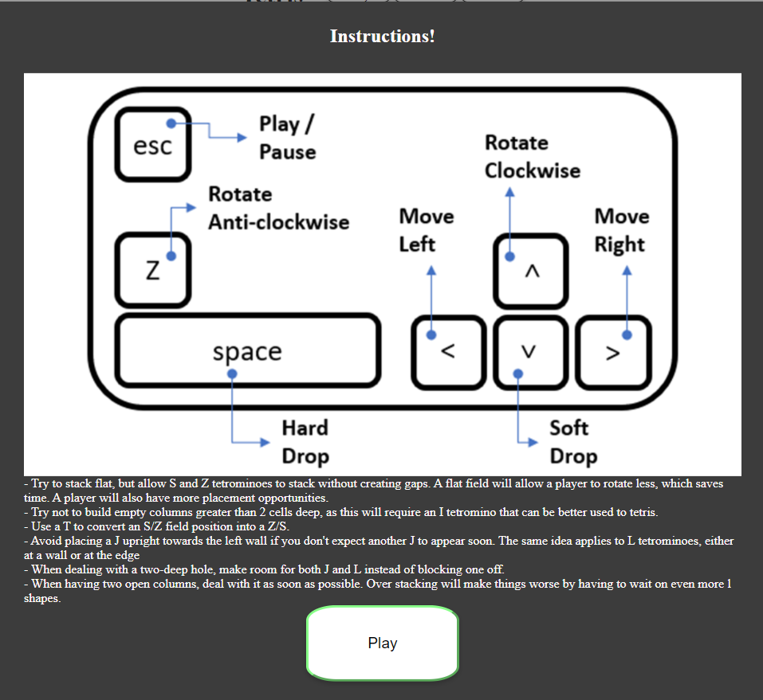

## Table of Contents
* [Purpose](#Purpose)
* [User Experience Design (UX)](#user-experience-ux)
  * [User stories](#User-Stories)
    * [First Time Visitor Goals](#First-Time-Visitor-Goals)
    * [Returning Visitor Goals](#Returning-Visitor-Goals)
    * [Frequent User Goals](#Frequent-User-Goals)
  * [Structure](#Structure)
    * [General Information](#General-Information)
    * [List Of Rules](#list-of-rules)
    * [Game Mechanics](#Game-Mechanics)
      * [Rotation](#rotation)
      * [Wall Kick](#wall-kick)
      * [Movement](#movement)
      * [Scoring System](#scoring-system)
      * [Leveling Up](#leveling-up)
    * [Methods Of Play](#Methods-Of-Play)
  * [Design](#Design)
    * [Colour Scheme](#Colour-Scheme)
    * [Typography](#Typography)
    * [Wireframes](#Wireframes)
    * [Limitations](#Limitations)
* [Features](#Features)
    * [Existing Features](#Existing-Features)
    * [Future Left to implement](#Features-Left-to-Implement)
* [Technologies](#Technologies)
* [Testing](#Testing)
    * [Test Strategy](#Test-Strategy)
      * [Summary](#Summary)
    * [Test Results](#Test-Results)
      * [Random shapes](#random-shapes)
      * [Rotation test](#clockwise-and-anti-clockwise-rotate)
      * [Floor touch](#shape-hit-the-floor)
      * [Walls touch](#shape-hit-the-left-or-right-wall)
      * [Another shape touch](#shape-hit-the-another-shape)
      * [Soft and Hard Drop](#shape-soft-drop-and-hard-drop)
      * [Shape Color](#shape-color)
      * [Next shape](#next-shape-display)
      * [Play / Pause](#play--pause)
      * [Sound](#sound)
      * [Modal popup](#modal-pop-up)
      * [Score](#score-adding-up-and-display)
      * [Top Scorey](#top-score)
      * [Level](#level-update)
      * [Game speed](#game-speed)
      * [Lock tetromino](#lock-in-place-delay)
      * [Game over](#game-over)
      * [Instructions](#instructions)
    * [Testing Issues](#Issues-and-Resolutions-to-issues-found-during-testing)
* [Deployment](#Deployment)
    * [Project Creation](#Project-Creation)
    * [GitHub Pages](#Using-Github-Pages)
    * [Locally](Run-Locally)
* [Credits](#Credits)
    * [Code](#Code)
    * [Content](#Content)
    * [Media](#Media)
    * [Acknowledgements](#Acknowledgements)
    * [Comments](#Comments)

## Purpose
This Game was created for the sole purpose of completing the second Milestone Project for the Code Institute's Full Stack Developer course. 
It was built using the knowledge gained from the HTML, CSS, User Centric Design and JavaScript modules. A full list of technologies used can be found in the technologies section of this document.

The live website can be found [here](https://bogdancatalin-iacob.github.io/Tetris/).
<!--  -->

## User Experience (UX)

-   ### User stories

    -   #### First Time Visitor Goals
        1. I want to view the game and content clearly on my mobile device.
        2. I want to find the game instructions easily

    -   #### Returning Visitor Goals
        1. I want to know what is the highest score

    -   #### Frequent User Goals
        1. I want to be able to fast drop the pieces
        1. I want increased difficulty with each level

-   ### Structure

    -   #### General Information
        - The website will have one page. The main page will display the Tetris game.
        - The largest part of the tetris game consists of the playfield measuring ten spaces across by twenty spaces down. It has other parts explained below.
        - Randomly selected tetrominoes, or shapes consisting of four square blocks, fall from the top of the playfield one at a time. Each tetromino enters the playfield with a random orientation and a specific color depending on its shape. 
        - Part of the tetris game (top roght corner) measuring 4 spaces across and 4 spaces down is called the piece preview, and shows the next pieces that will enter the playfield.
        - The player can rotate the falling tetromino ninety degrees (90deg) at a time within the playfield by pressing the clockwise rotation button (Arrow Up) / left mouse button / tap (on touch screens) or anti clockwise button (z) if the piece has room to rotate.
        - The player can shift (slide) the falling tetromino sideways one space at a time by pressing the left arrow / move the mouse towards left / drag left (on touch screens) or right arrow / move the mouse towards right / drag right (on touch screens). 
        - Pieces cannot shift through walls or other blocks.
        - Each tetromino moves downward slowly by itself. 
        - Generally a player can use a method to "drop" the tetromino (pressing spacebar on keyboard), or make it move downward faster (pressing Down Arrow on keyboard or dragging down on touch devices). Once the tetromino lands on the floor or other blocks, the piece will delay shortly before locking in place giving the player time to move it. After locking, a player can no longer move the tetromino.
        - When a tetromino locks and by doing so fills all empty spaces within one or more rows of the playfield, those full rows will clear. Remaining blocks above will move down by as many rows removed.
        - When lines are cleared some score will be awarded to player.
        - If the playfield has not filled up with blocks, the next piece enters.

    -   #### List Of Rules
        - A piece / shape / tetromino in Tetris is a geometric shape consisting of a set of blocks that is moved as a unit. A block (or mino) is the part of a piece that fills one unit of the playfield.
        - Game area is 10 columns x 24 rows.
        - First 4 rows are not part of the playing field, they are reserved for minigrid
        - Mini grid is 4 columns x 4 rows
        - Next shape is displayed in the mini grid
        - Tetromino colors are as follows:
            - l shape - Cyan
            - o shape - Yellow
            - t shape - Purple
            - s shape - Green
            - z shape - Red
            - j shape - Blue
            - L shape - Orange
        - Immediately drop one space if no existing block is in its path
        - The pieces selection will be done random from all available pieces
        - Initial rotation will be selected random from all possible piece rotations
        - Standard mapping for keyboard:
            - Up Arrow - rotate piece 90deg clockwise
            - Left Arrow - move the piece to left one cell if no obstruction
            - Right Arrow - move the piece to right by one cell if no obstruction
            - Down Arrow - move the piece down faster
            - z - rotate piece 90deg anti clockwise
            - space bar - hard drop
        - Standard mapping for mouse:
            - Slide mouse left - move the piece to left one cell if no obstruction
            - Slide mouse right - move the piece to right one cell if no obstruction
            - Left click - rotate the tetromino clockwise
        - Standard mapping for touch
            - Drag left - move the piece to left one cell if no obstruction
            - Drag right - move the piece to right one cell if no obstruction
            - Drag down - move the piece to down faster
            - Tap - rotate clockwise
        - Use of half second initial lock delay which will be decreased when level is going up
        - Next shape is displayed immediately after the playing tetromino gets out of the top right corner (mini grid)
        - When a row is fully covered / taken it must dissapear and score must be increased (line clear)
        - Top Score will be saved on local storage

    -   #### Game Mechanics

        - ##### Rotation
            - Initial rotation will be selected randomly for each spawned piece
            - Tetrominoes can be rotated clockwise or anti-clockwise
            - If the rotated tetromino overlaps another block, the rotation will be reverted so the shape appears not rotated
            - If the rotated tetromino goes beyond the bottom of the playfield, the rotation will be reverted so the shape appears not rotated

        - ##### Wall Kick
            - A wall kick happens when a player rotates a piece when no space exists in the squares where that tetromino would normally occupy after the rotation.
            To compensate, the game will move the piece one space into the opposite direction of the wall (for left wall position will move towards right and for right wall position will move towards left).

        - ##### Movement
            - The tetrominoes can move / slide towards left or right until they touch a side wall or another brick which occupies the square
            - Moving down is done automatically by the game at a 1000ms initial speed which will get faster when the player level is going up
            - Moving down can be done faster manually by pressing the moving down key (Down Arrow).
            - Hard drop (space bar key) of tetrominoes instant places the shape at the bottom of the playfield (if free) or on top of other blocks (if present) 
            - When the current tetromino touches the bottom of the play field or the top of another brick, the player has 500ms (or less depending on the level) to slide it in a different location before it locks down and a different piece is spawned.

        - ##### Scoring system
            | Level | | | Points for| |
            |:----:| :----:|:----:|:----:|:----:|
            | | 1 line | 2 lines | 3 lines | 4Lines |
            |1| 40 | 100 | 300 | 1200 |
            |2| 80 | 200 | 600 | 2400 |
            |3| 120 | 300 | 900 | 3600 |
            |n| 40 * n | 100 * n | 300 * n | 1200 * n |

        - ##### Leveling Up
            - Player may only level up by clearing lines. Required lines depends on the level.
            The variable goal is set to 5 times the level (5 * level).
            - The lines values for variable goal are:
                - single line = 1 line
                - double lines = 3 line
                - triple lines = 5 lines
                - tetris (4 lines) = 8 lines 

    -   #### Methods Of PLay
        - Stack flat, but not too flat, to allow S and Z tetrominoes to stack without creating gaps. Having a flat field will allow a player to rotate less, which saves time. A player will also have more placement opportunities. The even field will allow a player to think less which results in faster reaction times. Also, stacking flat will also mean keeping middle columns lower to the ground, lessening the risk of a block-out.
        - Try not to build empty columns greater than 2 cells deep, as this will require an I tetromino that can be better used to tetris.
        - Use a T to convert an S/Z field position into a Z/S.
        - Avoid placing a J upright towards the left wall if you don't expect another J to appear soon. The same idea applies to L tetrominoes, either at a wall or at the edge
        - When dealing with a two-deep hole, make room for both J and L instead of blocking one off.
        - When having two open columns, deal with it as soon as possible. Over stacking will make things worse by having to wait on even more l shapes.

<!-- The purpose of this is to fulfill user story:
> 

The purpose of this is to fulfill user story:
>  -->

- Custom CSS will be used to make the Website responsive by the use of media queries.

<!-- - The website will be responsive and the layouts will change dependant on screen size. This is to ensure content flow is appealing,
images are displayed properly and that the content is not shrunk side by side, so small that it is unreadable.
The purpose of this is to fulfill user story:
> As a First Time user, I want to view the game and content clearly on my mobile device. -->

- An icon in made with Favicon will be displayed in the browser's tab.
> This let users easily find the page in the browser.

-   ### Design
    -   #### Colour Scheme
        - The main colours used are: 
            - button hover: #ccc
            - button pressed: #8f8
            - game area background grid: #000
            - game area background squares: #444
            - modal h1, h2: #fffafa
        - Tetromino colors:
            - l shape - Cyan
            - o shape - Yellow
            - t shape - Purple
            - s shape - Green
            - z shape - Red
            - j shape - Blue
            - L shape - Orange

    -   #### Typography
        -   

    -   #### Wireframes
Home Page 
 

-   ### Limitations
    - Top score is saved on local storage due to no database

***
## Features
 
-   ### Existing Features
    - Initial modal with intructions and Play button
    
     
    - Game Over modal
    
     
    - Play / Pause button
    - Sounds button
    - Instructions button
    
     
    - Sound Effects
    - Instructions Modal
    
    
     
    - Next shape display
    
     
    - Top score display
    - Actual score display
    - Level display
    
     
    - Rotation system
    - Collision detection
    - Keyboard controls
    - Mouse controls
    
     
    - Touch controls
    
     

- Icon in the browser tab 
     

-   ### Features Left to Implement
    - Ghost piece
    - Ask name of the player before game start
    - Save name, level, top score on cloud

***

## Technologies

* HTML
	* This project uses HTML as the main language used to complete the structure of the Website.
* CSS
	* This project uses custom written CSS to style the Website.
* JavaScript
    * This project is interactive with the help of JavaScript
* [Font Awesome](https://fontawesome.com/)
	* Font awesome Icons are used for the Social media links contained in the Footer section of the website and for the benefits found on the index.html page.
* [Google Fonts](https://fonts.google.com/)
	* Google fonts are used throughout the project to import the *Spectral* and *Lora* fonts.
* [Gitpod](https://gitpod.io/)
	* Gitpod is the tool used to develop the Website.
* [GitHub](https://github.com/)
	* GithHub is the hosting site used to store the source code for the Website and [Git Pages](https://pages.github.com/) is used for the deployment of the live site.
* [Git](https://git-scm.com/)
	* Git is used as version control software to commit and push code to the GitHub repository where the source code is stored..
* [Google Chrome Developer Tools](https://developers.google.com/web/tools/chrome-devtools)
	* Google chromes built in developer tools are used to inspect page elements and help debug issues with the site layout and test different CSS styles.
* [Microsoft Excel](https://www.microsoft.com/en-us/microsoft-365/excel)
	* This was used to create wireframes for 'The Skeleton Plane' stage of UX design.
* [Techsini](http://techsini.com/multi-mockup/)
    * tecnisih.com Multi Device Website Mockup Generator was used to create the Mock up image in this README.
* [Favicon](https://favicon.io/)
    * This was used to generate the icon on browser's tab.
* [KeyCode](https://keycode.info/)
    * Keycode website was used to get the arrow key codes to move the tetrominoes on the game board

***

## Testing

-   ### Test Strategy 

    -   #### Summary 
        - Manual testing will be done on three different browsers (Chrome,Firefox, Opera).
        - Testing will be done for:
            - random shape
            - clocwise rotate and anti-clockwise rotate
            - shapes hit the floor
            - shapes hit left or right wall
            - shapes hit another shape
            - shape soft drop and hard drop
            - shape colors 
            - next shape display
            - play / pause
            - sound
            - modal pop-up
            - score adding up and display
            - top score
            - level update
            - game speed
            - lock in place delay
            - game over
            - instructions
        
    -   ### Test Results

        - #### Random shapes
            - each time the game starts a random shape must be selected - > work as expected
            - each new tetromino must be selected randomly -> work as expected

        - #### Clockwise and Anti-Clockwise rotate 
            - rotation must display the shape in the next logical position by pressing:
                - Up Arrow key for clockwise rotation
                - Z key for Anti-Clockwise rotation 
                - mouse left click for Clockwise rotation
                - touch displays tap for Clockwise rotation
            - if the next rotated position is getting the shape over the walls /floor limit or overlap another shape it will be reverted and the shape appears in the previous rotation
            -  work as expected

        - #### Shape hit the floor
            - if the shape touches the floor it must stop at that level (not passing through) -> work as expected

        - #### Shape hit the left or right wall
            - if the shape touches the left or right wall with any of the sides it must not go through and continue normal moving down
                - Left Arrow key for sliding left
                - Right Arrow key for sliding right 
                - Move mouse left for sliding left
                - Move mouse right for sliding right
                - Touch displays:
                    - Drag left for sliding left
                    - Drag right for sliding right
            - work as expected

        - #### Shape hit the another shape
            - if the shape touches another shape with any of the sides it must not overlap -> work as expected
            - if the shape touches with the bottom another shape top it must lock in place (after delay) -> work as expected

        - #### Shape soft drop and hard drop
            - faster down movement can be done by pressing Down Arrow Key -> work as expected
            - faster down movement on mobile devices can be don e by dragging down -> work as expected
            - instant drop can be done by pressing Spacebar key - it will place the shape on the last available free space and lock it in place with no delay -> work as expected
            
        - #### Shape color
            - each shape must have its own color (as described in [list of rules](#list-of-rules)) and keep it throughout the game -> work as expected
            - after locked in place the shapes will have a decreased opacity to differentiate from playing shape -> work as expected

        - #### Next shape display
            - next shape is selected randomly and displayed in the top right corner minigrid after the previous shape is out in the playing field -> work as expected
            - next shape color must follow the same color code as playing shape -> work as expected 

        - #### Play / Pause
            - when button text display "Play" if pressed the game is starting -> work as expected
            - when button text display "Pause" if pressed the game will be paused - work as expected

        - #### Sound
            - If sound is off and the button is clicked the sounds fx must play and the button text change to "Sound: On" -> work as expected
            - If the sound is on and the button is clicked the sound fx must stop playing and the button text change to "Sound: Off" -> work as expected
            - When the game is paused the sound goes off (if on) - worked as expected
            - When the game resume, the sound goes back to initial state before pause (on / off) -> work as expected 
            - When Instructions modal is displayed sound goes off -> work as expected
            - When Instructions modal is closed the sound gets back to initial state (on / off) -> work as expected

        - #### Modal pop-up
            - start-up modal  displays game controls:
                - for screens over 1024px keyboard and mouse controls -> work as expected
                - for screens under 1024px touch controls -> work as expected
                - "Play" button will close the modal and start the game -> work as expected
                - "Close" button will close the modal, but will not start the game -> work as expected

        - #### Score adding up and display
            - each time the player clears lines variable points will be awarded based on [scoring system](#scoring-system) -> work as expected
            - the current game score (real time update) is diplayed in the left top corner -> work as expected

        - #### Top score
            - top score is saved on local storage and returned every time the game starts ->work as expected
            - top score will be updated in real time if the saved top score is smaller than the current game score -> work as expected

        - #### Level Update
            - level must increase by 1 each time the player clears a specific number of line equal to (Level * 5) -> work as expected
            - number of cleared lines at once determine variable bonus lines counted for leveling up: 
                1. 1 line = 1 line
                1. 2 lines = 3 lines
                1. 3 lines = 5 lines
                1. 4 lines = 8 lines
                - this works as expected
            - every time level is increased the game speed is getting faster by 1% -> work as expected
            - every time level is increased the tetromino lock delay decreases by 1% -> work as expected
            - level is displayed in the top left corner

        - #### Game speed
            - initial speed of moving down (by default) a tetromino is 1000ms.
            - game speed is increased (the timer decreased) by 1% for each level completion -> work as expected

        - #### Lock in place delay
            - lock in place happens when a shape touches the bottom of the playfield or the top of another shape
            - initial delay before a tetromino is locked in place is 500ms.
            - lock delay is decreased by 1% for each level completion -> work as expected

        - #### Game over
            - if a shape is locked in place at the top (first row) of the playfield a modal will pop-up displaying "Game Over", the score and the level of the current game -> work as expected
            - when game is over the sound goes of(if on) and all the event listeners arer removed ->  work as expected
            - the modal has a Restart button which if clicked will reload the page to restart the game -> work as expected  

        - #### Instructions
            - when instructions button is clicked a set of helping information and an image of the controls will be displayed
                - if the screen size is under 1024px an image of touch controls is displayed -> work as expected
                - if the screen size is over 1024px an image of keyboard and mouse is displayed -> work as expected  
                - the game is paused -> work as expected
                - the sound is turned off (if on) -> work as expected
            - when instructions modal is closed:
                - the game resumes -> work as expected
                - the sound gets back to initial state before pause (on or off) -> work as expected

     
<!-- 
    - All Pages were run through the [W3C HTML Validator](https://validator.w3.org/) and showed no errors. 
     
     

    - CSS Stylesheet was run through the [W3C CSS Validator](https://jigsaw.w3.org/css-validator/validator) and showed no errors. 
      -->

    - Website was tested by running locally and tested on the deployed     version on three different browsers:
        - Google Chrome: 
        - Opera: 
        - Mozilla Firefox:  

    - ### Issues and Resolutions to issues found during testing
        - Tetrominoes where passing through the bottom of the board:
        - They were freezing at higher positions if manually set but when the setting was last row of the grid they were just passing down.  
        I had to set a flag into freezeTetromino() and pass the return to moveDown() as condition to change the current position.

        - Tetromino rotation was changing the randomly selected shape to the same one after first rotation
        - I had to refactor and return three values from the randomTetromino() function:
            - currentTetrominoShape - the piece placed on the gameboard
            - randomShape - the piece randomly selected in the pieces array (theTetrominoes)
            - randomRotation - the rotation of the tetromino when it is spawned
            and destructure this in new variables to be used to redraw the same shape with a different rotation.

        - Removing full rows to add score in addScore() function :
            - refactor variable square from const to let and assign an Array.from() grid childNodes to be able to slice() the full rows and add the same number of rows at the top of the grid so it won't appear smaller

        - When a tetromino was rotated between a wall and another block, it was kicked away from the wall but overlapped other block and locked in place:
            - isTaken() function was implemented to check overlapping blocks when rotate
            - also the same method was integrated into checkRotatedPosition() function to check overlapping blocks when tetrominoes hit the walls

        - When the tetromino was moved left / right or down using mouse / touch controls the blocks disappeared before locking in place.
            - the solution was to call freezeTetromino() after each move to ensure the blocks lock in place and remain displayed

## Deployment

-   ### Project Creation
The project was started by navigating to the [template](https://github.com/Code-Institute-Org/gitpod-full-template) and clicking 'Use this template'. Under Repository name I input "Tetris" and checked the Include all branches checkbox. I then navigated to the new [repository](https://github.com/BogdanCatalin-Iacob/Tetris). I then clicked the Gitpod button to open the project in Gitpod.

 The following commands were used throughout the project:
* git add *filename* - This command was used to add files to the staging area before commiting.
* git commit -m *commit message explaining the updates* - This command was used to to commit changes to the local repository.
* git push - This command is used to push all commited changes to the GitHub repository. 
* git pull - This command was used to get the updated content from github repository after I changed the Readme File on github.com

-   ### Using Github Pages
1. Navigate to the GitHub [Repository:](https://github.com/BogdanCatalin-Iacob/Tetris)
1. Click the 'Settings' Tab.
1. Scroll Down to the Git Hub 'Pages' Heading.
1. Select 'main' as the source.
1. Click the Save button.
1. Click on the link to go to the live deployed page.

-   ### Run Locally
1. Navigate to the GitHub [Repository:](https://github.com/BogdanCatalin-Iacob/Tetris)
1. Click the Code drop down menu.
1. Either Download the ZIP file, unpackage locally and open with IDE (This route ends here) OR Copy Git URL from the HTTPS dialogue box.
1. Open your developement editor of choice and open a terminal window in a directory of your choice.
1. Use the 'git clone' command in terminal followed by the copied git URL.
1. A clone of the project will be created locally on your machine.

***
## Credits
-   ### Code
    - The code for tetromino rotation at the edge of the board (left / right) was taken from [Ania Kubow](https://github.com/kubowania/Tetris-Basic/blob/a5b4d2bb17ca01234f23803c8fe86ee893b4bd45/app.js#L152)
    - The code for touch controls is based on the youtube tutorial [RTS CMK](https://www.youtube.com/watch?v=BzNFBs4p3FE)
    - The code for repeted sound play (each time when a tetromino is moved) was taken from [Mt. Ford Studios](https://www.youtube.com/watch?v=LfSBbrGqFV0)
   
-   ### Content
    - The game is developed based on some rules found on [tetris wiki](https://tetris.fandom.com/wiki/Tetris_Wiki):
        - bricks color
        - movement
        - rotation

-   ### Media
    - The sound effects were taken from [MixKit](https://mixkit.co/free-sound-effects/arcade/)
    - The background music was taken from [Chosic](https://www.chosic.com/download-audio/28361/)
    - The keyboard, mouse and touch images used in instructions are made by me (Bogdan Iacob)

-   ### Acknowledgements
    - I'd like to thank my mentor Daisy McGirr for her guidance throughout my project. 
